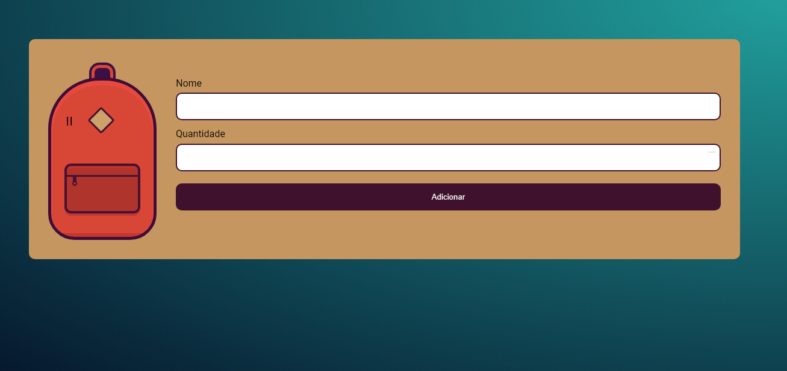

<h1 align="center">
📚 Mochila de Viagem 
Curso na Alura - JavaScript na Web: armazenando dados no navegador
</h1>

## 🔨 Funcionalidades do projeto

Aprendendo o comportamento e registrando dados no LocalStorage e criando objetos no JavaScript.

